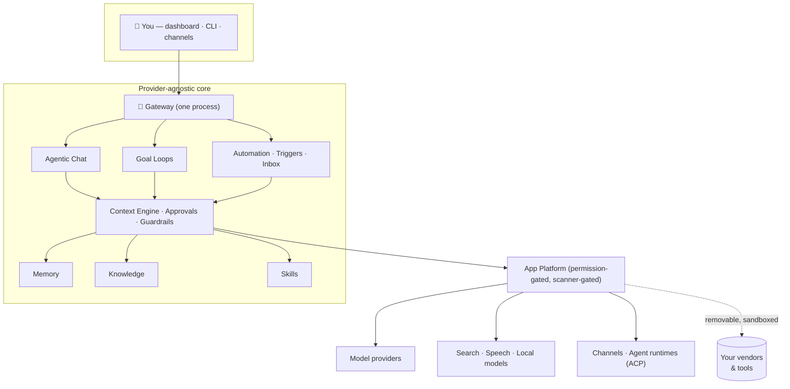

<div align="center">


# Gideon

**Your self-hosted personal AI agent — an agentic operating system for one person.**

Chat, autonomous goal loops, long-term memory, a knowledge base, skills, scheduled
automation, and channel integrations — all behind one gateway process and one web
dashboard you own. Local-first, provider-agnostic, zero telemetry, MIT.

[](https://github.com/Gideon/Gideon/actions/workflows/ci.yml)
[](LICENSE)
[](pyproject.toml)
[](#privacy)
[](#)
[](#-pre-10-heads-up)


<sub><em>The dashboard — tasks, active work, and context-aware suggestions at a glance. Dark theme shown; Gideon ships light and dark.</em></sub>

<table>
<tr>
<td width="50%"></td>
<td width="50%"></td>
</tr>
</table>

<p><strong>📸 <a href="SHOWCASE.md">See the full visual showcase »</a></strong> — dashboard, chat, goal loops, knowledge, memory, tasks, skills, automation, agents, and settings, in light and dark.</p>

</div>

---

## <a name="-pre-10-heads-up"></a>⚠️ Pre-1.0 — breaking changes expected

Gideon is at **v0.1.3** and moving fast toward a deeper architecture (see the
[roadmap](docs/roadmap/roadmap.md)). It follows a **clean-break** engineering doctrine:
when a design is replaced, the old path is removed in the same change rather than carried
along behind compatibility shims. The upshot for you as an early user:

- **The next few minor (0.x) releases may introduce breaking changes with no automatic
  migration of your existing data** — sessions, memory, knowledge, config, and app state
  under `~/.gideon` may need to be recreated after an update.
- **Back up before every update.** Run `gideon snapshot` to create a portable state
  archive first (restore with `gideon restore`), and keep the archive somewhere safe.
- **Don't make this your only system of record yet.** Treat anything you put in
  Gideon as reproducible or backed up elsewhere until backward compatibility becomes
  the default posture — the point at which gated, migration-backed changes replace
  clean breaks (the lifecycle mental model in
  [CONTRIBUTING.md](CONTRIBUTING.md#breaking-changes)). Until then, run it as a power-user's
  second machine, not your primary driver.
- **This is expected to last a while.** Migration-backed change discipline is scheduled
  deliberately *late* — it lands once the architecture has stopped moving, near the end of
  the current [roadmap](docs/roadmap/roadmap.md), because freezing compatibility around a
  half-built architecture is worse than breaking it honestly now. Plan for breaking 0.x
  updates as the norm, not the exception, for the foreseeable future.

This warning is relaxed only when that discipline lands — not on a date. We'd rather tell
you plainly now than surprise you on an update.

**Contributing?** None of this asks *you* to break compatibility: contributor changes stay
additive, and breaking changes are the maintainer's call. See
[CONTRIBUTING.md → Breaking changes](CONTRIBUTING.md#breaking-changes).

---

## What is Gideon?

Gideon runs AI agents that accomplish *your* work with a rich, user-assembled set
of capabilities. Every vendor — model providers, search, speech, channels, agent
runtimes — is a **removable app**, so nothing ties you to a single LLM vendor or service.
All state lives under one `~/.gideon` home on your machine; the system degrades
gracefully to local-only and never requires the network for core operation.



## Highlights

### 🗣️ Agentic chat
Multi-session chat with tool use and approval controls, session forking/undo, answer
variants, folders/tags/kanban, side conversations, per-session model overrides, and
temporary/incognito memory modes.

### 🎯 Goal loops
Give the agent a target and let it work autonomously — it classifies the goal, plans it,
then loops cycle by cycle under a **deterministic supervisor** you can pause, nudge, or stop.

### 🧠 Memory that learns
Layered semantic + episodic + procedural memory with active recall, after-turn learning
from your corrections, automatic promotion of repeated facts, and an optional
Obsidian-compatible markdown vault.

### 📚 Knowledge base
Ingest documents (PDF/DOCX/PPTX/HTML/…), web pages, and media; AI enrichment, entity
extraction, a knowledge graph, and semantic search wired into chat context.

### 🧩 Skills & 🔌 App platform
Reusable SKILL.md procedures with a marketplace and supply-chain scanning; a permission-gated
**Store** where model providers, search, speech, local models, channels, agent runtimes, and
full backend+UI apps install through a quarantine → scan → consent lifecycle.

### ⏰ Automation
Cron/interval/webhook triggers, background subagents, an inbox that watches channels and
drafts replies, and workflow SOPs surfaced automatically when they match.

### 🛡️ Security-first
Tool approval modes, a shell-command denylist, an egress guard with allow/deny host policy,
a tamper-evident (HMAC) security event log, app-scoped tokens, and honest labeling of the
one permission it can't technically enforce. Controls are enforced at the point of execution,
not merely requested in a prompt — the [threat model](docs/security/threat-model.md) maps each
to the OWASP Agentic Top-10 with code citations and states the limitations plainly. Found a
security issue? Report it privately via [our security policy](SECURITY.md). See also the
[security model](docs/architecture/security.md).

## Quickstart

Install with one command — every path installs the **same release artifact** (no
per-channel special builds), and you don't need to install Python or Node yourself:

```bash
uv tool install gideon && gideon setup     # recommended — uv brings Python 3.12
```

Or use the bootstrap one-liner (installs `uv` if it's missing, then the above):

```bash
curl -fsSL https://gideon.dev/install | sh
```

Then start the gateway:

```bash
gideon gateway
```

### Install matrix

| Path | Command | Best for |
|---|---|---|
| **uv tool** *(recommended)* | `uv tool install gideon` | anyone — `uv` provides Python 3.12 |
| **Bootstrap** | `curl -fsSL https://gideon.dev/install \| sh` | the fastest start |
| pipx | `pipx install gideon` | isolated Python tools |
| pip | `pip install gideon` | inside an existing Python 3.12+ venv |
| **Docker Compose** | see below | self-hosters · Windows |
| Git checkout | [CONTRIBUTING](CONTRIBUTING.md#development-setup) | contributors / development |

### Docker Compose

```bash
cp .env.example .env && docker compose -f deploy/compose/compose.yaml up -d
```

Brings up the gateway + a TLS web proxy with a persistent volume — details, backups,
and updates in the [container guide](docs/guides/containers.md).

The dashboard opens at `http://localhost:10000`. Install a model-provider app from the
Store, add your API key under **Settings → Providers**, and bind a chat model under
**Settings → Models** — full walkthrough in [Getting started](docs/guides/getting-started.md).

> **Tech stack:** Python 3.12 · aiohttp gateway · React + Vite SPA · SQLite · MIT.
> **Run modes:** local process · Docker Compose · systemd/launchd service. (A macOS-only
> Electron desktop shell exists but is experimental — not built, signed, or released by CI,
> and has no auto-update channel.)

**Platform support.** Every row names what proves it — `CI:<job>` is a workflow job,
`checklist:<section>` is a documented manual walkthrough, `community` is user-reported
and not verified by us. Details and the `[models]`-extra per-arch reality:
[Platforms](docs/guides/platforms.md).

| Platform | Support | Proof |
|---|---|---|
| Linux x86-64 | first-class | `CI:full/matrix (ubuntu-latest)` + release smoke |
| Linux arm64 | first-class | `CI:full/matrix (ubuntu-24.04-arm)` + release smoke |
| macOS Apple silicon | first-class | `CI:full/matrix (macos-14)` |
| macOS Intel | best-effort | `community` |
| Windows via WSL2 | supported | `checklist:Windows via WSL2` — [Platforms](docs/guides/platforms.md) |
| Windows via Docker Desktop | supported | `checklist:Windows via Docker Desktop` — [Platforms](docs/guides/platforms.md) |
| Windows native | not supported | — |

## <a name="privacy"></a>Privacy

**Zero telemetry.** Gideon sends no usage data anywhere. It's single-user and
self-hosted; your conversations, memory, and knowledge never leave your machine unless
*you* wire up a remote provider app. Exports exclude credentials by design.

## Supply chain

The release pipeline practices the install-time gating the product itself preaches:
builds run in CI from a committed lockfile (`uv.lock`, installed with `uv sync
--locked`); PyPI publishing uses **Trusted Publishing** (OIDC — no long-lived tokens
stored anywhere) behind a manual owner-approval gate; every release attaches a **syft
SBOM** and **build-provenance attestations** on the wheel and images; and Dependabot
watches the pip, npm, and GitHub-Actions ecosystems weekly. `pip-audit` and `npm audit`
run on every push to `main`.

## Documentation

- [Getting started](docs/guides/getting-started.md) — install → first chat.
- [Remote access](docs/guides/remote-access.md) — reaching your dashboard from outside your home network (tunnel + password + 2FA), and what it does *not* protect you from.
- [Companion apps](docs/guides/companion-apps.md) — a phone or a second machine on your own network: pairing, the optional LAN discovery (off by default), and exactly what it announces.
- [Build a channel app](docs/guides/build-a-channel-app.md) — bringing a new chat app or mailbox to Gideon: the transport/delivery obligations, trust and pairing, and the conformance kit.
- [The desktop app](docs/guides/desktop.md) — the native capabilities a browser tab cannot offer: global push-to-talk (what it captures, when, and how you can always tell), and why system audio is microphone-only.
- [Architecture overview](docs/architecture/overview.md) — the system map (with diagrams).
- [Configuration reference](docs/reference/configuration.md) · [CLI](docs/reference/cli.md) · [API](docs/reference/api-overview.md)
- [Roadmap](docs/roadmap/roadmap.md) — 52 plans across 6 pillars, with a shared execution protocol.
- [Visual showcase](SHOWCASE.md) — every screen, light and dark.

## Contributing

See [CONTRIBUTING.md](CONTRIBUTING.md) for the engineering doctrine (clean-break-within-class,
provider-agnostic core, validate-as-a-user) and dev setup. First-party apps live in the
[GideonApps](https://github.com/Gideon/GideonApps) repo — the community front door.

Looking for somewhere to start? The
[good-first-issue](https://github.com/Gideon/Gideon/issues?q=is%3Aopen+label%3Agood-first-issue)
label marks well-scoped work that needs little context.

**Questions, ideas, showing off what you built:**
[Discussions](https://github.com/Gideon/Gideon/discussions) — Q&A for help,
Show and tell for what you've made, Ideas for feature thinking. Bugs go to
[Issues](https://github.com/Gideon/Gideon/issues) instead, so they can be tracked
and closed.

The roadmap is maintainer-owned, but not opaque: propose changes in
[Discussions → Ideas](https://github.com/Gideon/Gideon/discussions/categories/ideas)
rather than by PR'ing `docs/roadmap/`. See
[the intake path](docs/roadmap/roadmap.md#proposing-roadmap-changes).

## License

[MIT](LICENSE)
