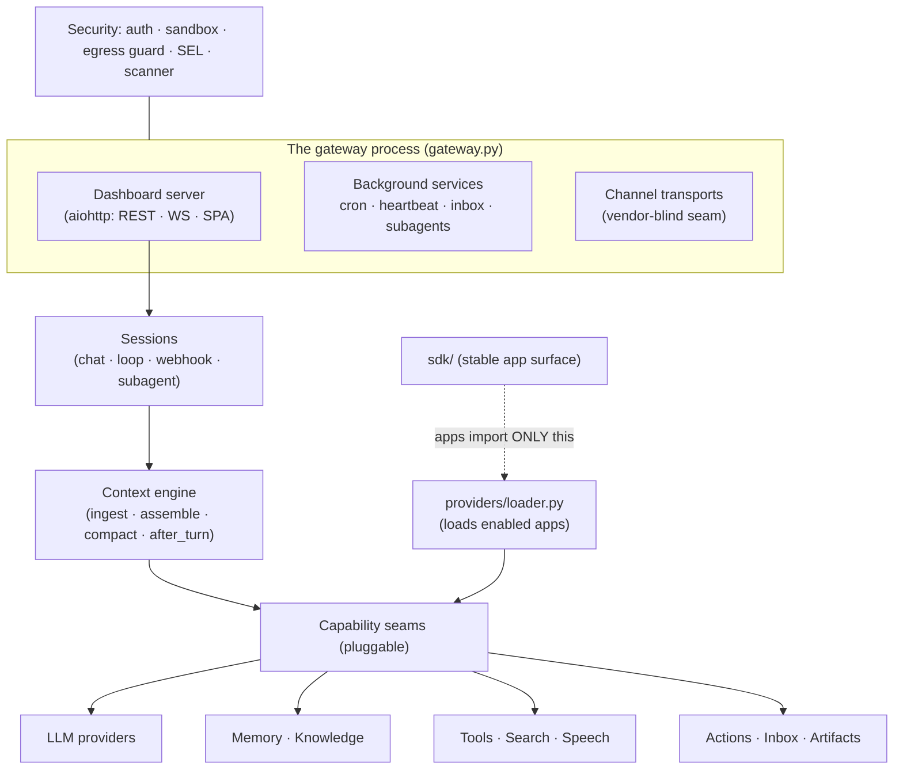

# Gideon — Architecture Overview

Gideon is a self-hosted personal AI gateway: one long-running process that
hosts chat sessions, autonomous loops, a knowledge base, memory, tasks,
scheduling, an inbox, and an app platform — all behind a local web dashboard.
This document is the map; each subsystem has its own reference doc (linked
throughout).

Paths below are relative to the core package `Gideon/src/gideon/`
unless noted.

## The core tenet: provider-agnostic core

**The core package contains only capability-enabling logic and pluggable
contracts. Anything that integrates a *specific* provider (Slack, OpenAI, a
particular local model, …) lives in an app bundle, never in core.**

Core owns protocols, registries, and resolvers; apps own endpoints, auth,
catalogs, binary resolution, and wire formats. The full boundary-judgment table
— including the deliberately-kept exceptions (wire-protocol clients, secret
detection patterns, credential key names) — is in
[provider-boundary.md](provider-boundary.md).

App bundles come in three tiers:

| Tier | Location | Examples |
|---|---|---|
| Native | `src/gideon/apps/native/` (26 bundles, shipped in-package, seeded and locked on) | `native-agents`, `gideon-memory`, `bash-action` |
| First-party | `apps/` at the workspace root (36 bundles) | `slack-channel`, `anthropic-models`, `faster-whisper` |
| Third-party | user-installed into `~/.gideon/apps/` | `third-party-apps/hello-search`, `demo-dashboard` (fixtures) |

## Process model: the gateway

`gateway.py` defines `GatewayOrchestrator` and the `run_gateway` entry point —
one process that boots everything:

- **Background services** — cron scheduling (`schedule.py`), heartbeat
  (`heartbeat.py`: pending-task dispatch, and driving the health-scored
  remediation engine that owns store maintenance — FTS reconciliation, the
  history/SEL prunes, skill aging — see `resilience/remediation.py`), autonudge
  (`autonudge.py`: reactive same-session self-prompting), inbox polling
  (`inbox_service.py`), background subagents (`subagent.py`), and MCP server
  wiring.
- **The dashboard server** — `dashboard/server.py`, an aiohttp app serving the
  REST API, WebSocket event fan-out, and the built SPA (see below).
- **Channel transports** — the gateway names no channel vendor. It iterates
  `channel_transports/manager.py` `list_transports()` and calls each
  transport's `start_inbound(services)`, handing it a `GatewayServices`
  protocol object (`gateway_services.py`) that exposes the shared runtime:
  sessions, context builder, conversation log, consolidator, cron service,
  subagent manager, channel history, dashboard state, config, and owner id.
  Outbound delivery flows through the registered `ChannelDelivery` protocol
  (`channel_delivery.py`) — see [inbox-channels.md](inbox-channels.md).
- **Service management** — `service/` installs the gateway as a systemd unit
  (Linux) or launchd agent (macOS, label `io.gideon.gateway`); the CLI
  lifecycle lives in `cli_server.py` (`gideon gateway`, with a
  `--headless` mode for channel-only operation).

**Restart discipline** (matters when developing): backend `.py` changes need a
gateway restart. The frontend is served live from `web/dist` — a rebuild is
enough. Installed app copies at `~/.gideon/apps/<name>/` are what the
gateway actually loads; edits to the repo `apps/` tree reach a running gateway
only via `POST /api/apps/{name}/update`.

## The dashboard server

`dashboard/server.py` assembles the aiohttp application:

- **Route handlers** live under `dashboard/handlers/` (one module per feature
  area: `sessions.py`, `knowledge.py`, `memory.py`, `apps.py`, `schedule.py`,
  `terminal.py`, `updates.py`, …) plus the chat pipeline modules directly under
  `dashboard/` (`chat_runner.py`, `chat_handlers.py`, `chat_persistence.py`, …).
- **Auth middleware** — token auth (`dashboard/token_auth.py`), CSRF, and
  app-permission middlewares; ordering is explicit in `server.py`. Modes and
  the `AUTH_MODE=none` loopback invariant are covered in
  [security.md](security.md).
- **Live state** — `dashboard/state.py` (`DashboardState`) is the shared
  in-memory hub: WebSocket event broadcast, notifications
  (`DashboardState.notify()` is the single notification choke point), and the
  session/channel link maps.
- **Static frontend** — the SPA is a Vite + React app at `Gideon/web/`,
  built to `web/dist` and served through a `static/dist` symlink. It uses a
  hash router with a URL-navigation doctrine (state lives in the URL;
  enforced by a frontend test), shared shell primitives
  (TopBar/ListScaffold/SidePanel/HeaderActions) that own the chrome, and design
  tokens in `web/src/design/tokens.css`.

## Session model

A **session** is one conversation thread — dashboard chat, a channel thread, a
loop worker, a webhook run, or a subagent all get one:

- `session.py` — `SessionManager`; each session has a FIFO message queue so a
  channel thread serializes its turns.
- `session_map.py` — the persistent session↔thread map
  (`~/.gideon/session_map.json`); entries carry generic `thread_ts` /
  `channel_id` keys, so a dashboard chat can be linked to a channel thread and
  back.
- `session_restrictions.py` — memory modes: **temporary** (blank slate — memory
  reads AND writes suppressed) and **incognito** (writes suppressed, reads
  allowed). The registry is core because any surface (dashboard or channel) can
  request either mode.
- `history.py` — one JSONL file per session under `~/.gideon/sessions/`,
  with 2 MB rotation to `sessions/archive/` and 7-day archive retention.

Details, including the chat turn pipeline and variant branching, are in
[chat-sessions.md](chat-sessions.md).

## Capability seams

Every capability is behind a pluggable seam. The extension system that loads
them is `providers/` (`providers/loader.py` loads each enabled app, pins its
directory on `sys.path`, and registers its contributions through a typed
`ToolTypeHandler`). The stable app-facing import surface is `sdk/` (26 modules
— apps import core **only** via `gideon.sdk.*`, enforced by
`tests/test_apps_import_boundary.py`).

| Capability | Core seam | Contributed by |
|---|---|---|
| LLM providers | `llm/registry.py` (`registry.build`), `llm/catalog.py` | model apps (`apps/anthropic-models`, `apps/openai-models`, `apps/ollama-models`, …) |
| Model bindings | `~/.gideon/active_models.json` per use case (chat, background, embedding, ingestion, stt, tts, …) | Settings → Models |
| Channels | `channel_transports/` (inbound) + `channel_delivery.py` (outbound) | `apps/slack-channel` (reference implementation) |
| Agents | `agents/native/` runtime + `acp/` (Agent Client Protocol) | ACP agent apps (`apps/claude-code-agent`, `apps/codex-agent`, …) |
| Tools | `tool_providers/` registry + `mcp_client.py` for external MCP servers | tool apps, app-shipped MCP servers |
| Search | `search_providers/` (capability model incl. `keyless` floor) | 7 search apps |
| Embeddings | `embedding_providers/` ABCs; `knowledge/embedder.py` `UnifiedEmbedder` | `apps/sentence-transformers` or any bound provider |
| Speech | `stt/` + `tts/` + `diarization/` registries | `apps/faster-whisper`, `apps/piper-tts`, … |
| Local models | `local_models/` (`LocalModel`/`LocalModelProvider` management contract) | the 5 local-model apps |
| Inbox sources | `inbox_providers/` + `provider_registry.py` | native push + filesystem sources |
| Actions (triggers) | `action_providers/` registry | native action bundles |
| Artifacts | `artifacts/` provider registry | native filesystem provider |

## Subsystem index

| Subsystem | Doc | Core modules |
|---|---|---|
| Provider boundary | [provider-boundary.md](provider-boundary.md) | `llm/`, `sdk/`, `media_catalogs.py` |
| Chat & sessions | [chat-sessions.md](chat-sessions.md) | `session.py`, `dashboard/chat_*.py`, `history.py`, `context.py` |
| Loops & projects | [loops.md](loops.md) | `loop/`, `planning/`, `grill.py`, `projects.py` |
| Knowledge & memory | [knowledge-memory.md](knowledge-memory.md) | `knowledge/`, `vector_memory.py`, `memory_service.py` |
| Tasks & triggers | [tasks-triggers.md](tasks-triggers.md) | `tasks/`, `schedule.py`, `event_triggers.py` |
| Workflows | [workflows.md](workflows.md) | `workflows/` (engine, frontier, journal, mutation, templates) |
| Inbox & channels | [inbox-channels.md](inbox-channels.md) | `inbox.py`, `inbox_service.py`, `channel_delivery.py` |
| App platform | [app-platform.md](app-platform.md) | `apps/app_manager.py`, `apps/backend_runtime.py`, `apps/permissions.py` |
| Security | [security.md](security.md) | `security.py`, `net/`, `auth/`, `sel.py`, `supply_chain.py` |
| Agent worlds | [agent-activity-feed.md](agent-activity-feed.md) | `web/src/lib/useAgentActivity.ts`, `web/src/pages/dashboard/world/` |

## Configuration

`config/loader.py` defines the `AppConfig` dataclass tree
(`~/.gideon/config.json`). A config field works end-to-end only when it
is wired through: (1) the dataclass + `_meta` metadata, (2) `load()`'s explicit
mapping, (3) `to_dict()`, (4) an API write path (the `_EDITABLE_CONFIG` PATCH
allowlist or a dedicated PUT), and optionally (5) a frontend control.
`tests/test_config_roundtrip.py` enforces (1)–(3) generically.

Entity settings deliberately live *outside* config.json:
`~/.gideon/entity_settings/{inbox,notifications}.json`, use-case settings
under `~/.gideon/extensions/use_case_settings/`, model bindings in
`active_models.json`, search bindings in `active_search_providers.json`, and
each app's own `data/config.json`. Backend-only operator knobs are documented
in `docs/reference/CONFIG-REFERENCE.md`.

## Self-update

`dashboard/handlers/updates.py` (`api_update_apply`) runs the public update
pipeline: `git pull` → `pip install -e .` (into the running venv) → frontend
build → graceful re-exec, reporting steps
`pulling → installing → building → restarting` over `update_progress`
WebSocket events. A pip failure aborts *before* restart; concurrent applies get
a 409. This covers the **core repo only** — apps update individually through
the Store (`POST /api/apps/{name}/update`).
