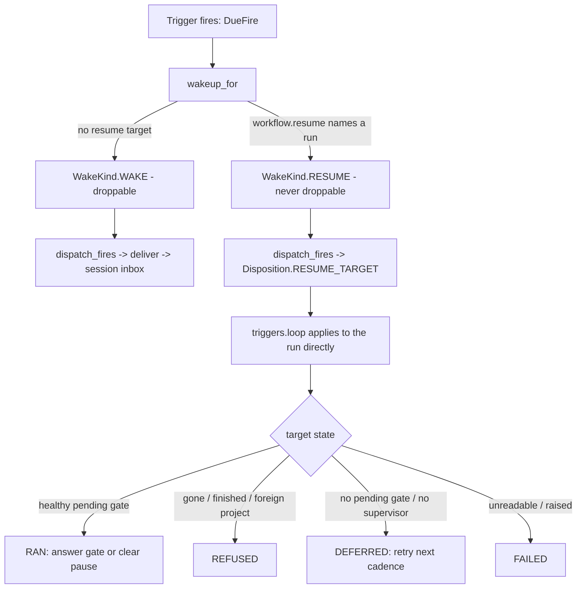

# WF2AUT-14 — the resume-target contract (ratified as filed)

**Atom:** ratify the resume-target surface that shipped on 2026-08-28 as the stable
substrate contract for AUTO-R11, and file the delta between what the original
[AUTOMATION-SUBSTRATE plan](../plans/WORKFLOWS-V2-AUTOMATION-SUBSTRATE.md) named and what
actually shipped — each orphan item kept or descoped with a reason.

The surface itself is **not new work**: `wakeup.resume_target_of` /
`wakeup.wakeup_for` / `wakeup.dispatch_fires` (in `src/gideon/triggers/wakeup.py`),
the save-time validator `models._resume_target_issues` and its field set
`models._RESUME_TARGET_FIELDS` (in `src/gideon/triggers/models.py`), and the
end-to-end pins in `tests/test_triggers_resume_target.py` all landed with WF2AUT-2/§3.2 and
its follow-ups. This atom's job is to write that surface down as **the** contract a consumer
may rely on, so the next author extends it deliberately instead of re-deriving it — and to
account for the parts of the original scope that did not survive contact with the code.

## What "resume-target" means

AUTO-R11's one sentence: *a trigger fires — or **resumes** — a WorkflowRun.* A trigger whose
`workflow` declares a `resume` target does not start a new run; it wakes a **parked** run,
either answering the gate it is blocked on or clearing its pause so it carries on. The plan
framed this as *"resolve a wait/gate node in an existing run"*; the shipped surface resolves
it at the **run** level (the run's own currently-pending continuation), not at a
caller-named node — see the orphan delta below.

## The ratified contract

### 1. Authored form — `workflow.resume`

A trigger declares a resume target as an object under the `workflow.resume` key
(`wakeup.RESUME_TARGET_KEY == "resume"`). The accepted fields are exactly
`models._RESUME_TARGET_FIELDS`:

| Field | Required | Meaning |
|---|---|---|
| `run_id` | **yes** | The parked run to resume. A blank/absent `run_id` is "no target" — the trigger falls back to an ordinary new-run wake. |
| `project_id` | no | Scope guard. When present, a resume whose run belongs to a different project is **refused** (run ids are reused across restore/fork). |
| `resume_token` | no | Optional single-use gate token, passed through to `workflows.service.resume_run`. |
| `answer` | no | The gate answer. **Presence** (not truthiness) is what counts: `answer` present ⇒ answer the pending gate with this value (`false` and `null` are legitimate answers); `answer` absent ⇒ clear the pause and let the run carry on. |

A resume target **replaces** the action — declaring both `resume` and any of
`models._ACTION_KEYS` (`inline` / `provider` / `ref`) is a save-time error, because
`wakeup.wakeup_for` picks the resume and the configured action would silently never run.

### 2. Normalized form — `wakeup.resume_target_of`

Every consumer reads one normalized shape rather than re-deriving it from the raw authored
dict. `resume_target_of(trigger)` returns exactly these keys, or `{}` when no `run_id` is
named:

| Key | Derivation |
|---|---|
| `run_id` | stripped `run_id` |
| `project_id` | stripped `project_id` (`""` when unset) |
| `resume_token` | stripped `resume_token` (`""` when unset) |
| `gate_answer` | the raw `answer` value (may be `False`/`None`) |
| `answers_gate` | `True` iff the `answer` key is **present** — the presence test, never truthiness |

This function is the **one** place that is fail-open: a `resume` block with no `run_id`
names nothing and reads as "no target", so an authoring slip degrades to a normal fire
rather than silently disabling the trigger. The author is told about the slip at save time
by `models._resume_target_issues`, not at runtime.

### 3. Dispatch surface

- `wakeup.WakeKind.RESUME` — a resume is **never droppable** (§3.2: overlap guards must
  never eat gate answers intended for parked runs).
- `wakeup.Disposition.RESUME_TARGET` — a run-targeted resume **never reaches a session
  inbox**. `executor.drain` does not dispatch on `Wakeup.kind`, so an inbox-queued resume
  would be run as the trigger's ordinary action; `dispatch_fires` routes it to
  `RESUME_TARGET` and `triggers.loop` applies it to the run directly.
- `wakeup.Disposition.REQUEUED` / `wakeup.retry_queue` — the **session-targeted** resume
  path (`wakeup.resume_for` with a non-empty `session_key`): an undeliverable resume is
  requeued, never dropped. Distinct from the run-targeted feature above, which is applied
  directly and never requeued.

### 4. Missing / unusable target — fail-closed and legible

Because a resume fires unattended, a target that cannot be honored says why rather than
guessing. The outcomes (`models.Outcome`, each carrying a mandatory reason):

| Situation | Outcome | Why |
|---|---|---|
| run gone, finished, or a declared `project_id` disagrees | `REFUSED` | Fail-closed: starting a new run or resuming a stranger's run unattended is worse than refusing one already-broken automation. |
| no pending gate yet, or no workflow supervisor attached yet | `DEFERRED` | Transient: postponed to the trigger's next cadence (the schedule *is* the retry), never requeued onto an inbox. |
| store unreadable, or `resume_run` raised | `FAILED` | "We could not tell", distinct from "your target is wrong"; one trigger's fault never propagates into the shared clock loop. |

## Fire → resume routing

## Orphaned-scope delta (original plan vs what shipped 2026-08-28)

The original R11 named the authored form as `workflow: {resume: {run_id, node_id}}` and
framed the capability as resolving a **node**. The shipped surface is run-targeted and
carries a different field set. Each item below is the original scope reconciled against the
code, kept or descoped with a reason.

| Original scope item | Shipped? | Decision | Reason |
|---|---|---|---|
| `workflow.resume.run_id` | yes | **keep** | The run to resume — the whole target. |
| `workflow.resume.node_id` | no | **descope** | The resume resolves the run's *own* currently-pending continuation (`workflows.human_input.list_continuations` / `consume_continuation`). A caller-named `node_id` would be a second, forgeable answer to "which wait is pending" that can disagree with the run's actual pending gate — run-targeting is the safe contract and node addressing is both redundant and a mis-address hazard. |
| capability: "resolve a wait/gate node in an existing run" | yes (run-scoped) | **keep (reframed)** | Shipped as: answer the run's pending gate (`answer` present) or clear its pause (`answer` absent), resolved at the run level rather than a named node. |
| fire-path step "resolve def / resume target" | yes | **keep** | `wakeup.wakeup_for` → `dispatch_fires` → `Disposition.RESUME_TARGET` → `triggers.loop`. Had zero producers before this surface; now wired end-to-end. |
| §3.2 / AUTO-R16 wake-vs-resume, resume never droppable, `REQUEUED` for an undeliverable resume | yes | **keep (clarified)** | Run-targeted resumes are applied directly via `RESUME_TARGET` and never enter an inbox; `REQUEUED` / `retry_queue` remain for the *session-targeted* resume path (`resume_for` with a session key). Both are part of the contract; they are different paths. |

Shipped **beyond** the original scope, and ratified here as part of the contract:

| Shipped addition | Decision | Reason |
|---|---|---|
| `workflow.resume.project_id` scope guard | **keep** | Run ids are reused across restore/fork; a declared project that disagrees refuses the resume rather than waking a stranger's run unattended. |
| `workflow.resume.resume_token` pass-through | **keep** | Lets a target name a specific single-use gate token; forwarded to `workflows.service.resume_run`. |
| `answer` presence-semantics + derived `answers_gate` | **keep** | Distinguishes "answer the gate" from "clear the pause" without a truthiness test that would misread `answer: false` / `null` — the most consequential answers in the vocabulary. |
| normalized `gate_answer` / `answers_gate` output keys | **keep** | One normalized shape for every consumer instead of re-deriving from a raw authored dict. |
| `REFUSED` / `DEFERRED` / `FAILED` missing-target dispositions | **keep** | Fail-closed and legible for an unattended fire (see §4). |

No orphan item is left un-implemented: the only original element not shipped is `node_id`,
and it is **descoped**, not deferred.

## Consumer — WF2LOO-9 uses the public contract

The [WF2LOO-9 goal-pursuit-monitor](../atomic/WF2LOO.md) is the first consumer, and it
reaches the contract through the public surface only — no private workaround:

- **Write side** — the `set_onetime_task` / `set_recurring_task` tool module
  (`src/gideon/triggers/tools.py`) builds `workflow = {"resume": target}` under the
  public `resume` key, limits `target` to the authored fields above, maps a caller
  `message` to the gate `answer`, and refuses a target declared alongside a workflow
  action (mirroring the save-time validator).
- **Read side** — `tests/test_goal_pursuit_monitor.py` imports
  `wakeup.RESUME_TARGET_KEY` and `wakeup.resume_target_of` and reads the run id and
  `answers_gate` back through them, never off a raw dict.

## What pins the contract surface

- `tests/test_triggers_resume_target.py` — the end-to-end behavioural pins (a real run is
  driven to a real gate and resumed; the missing-target dispositions; idempotence).
- `tests/test_triggers_resume_target_contract.py` — the ratification ratchet added by this
  atom: it pins `RESUME_TARGET_KEY`, the exact `_RESUME_TARGET_FIELDS` authored set, the
  exact normalized-output key set, and that `node_id` is a rejected (descoped) field — so a
  future change to the ratified set is a deliberate edit to a red test, not a silent drift.
